# Plataforma Codefólio - Guia Completo de Uso

## 📋 Índice
1. [Visão Geral](#visão-geral)
2. [Primeiros Passos](#primeiros-passos)
3. [Gerenciamento de Cursos](#gerenciamento-de-cursos)
4. [Sistema de Quizzes](#sistema-de-quizzes)
5. [Avaliações Personalizadas](#avaliações-personalizadas)
6. [Acompanhamento de Alunos](#acompanhamento-de-alunos)
7. [Recursos Avançados](#recursos-avançados)
8. [Dicas e Melhores Práticas](#-dicas-e-melhores-práticas)
9. [Problemas Comuns e Soluções](#-problemas-comuns-e-soluções)

---

## 📖 Visão Geral

A **Plataforma Codefólio** é um ambiente completo de ensino e aprendizagem que permite aos professores criar cursos interativos, aplicar avaliações e acompanhar o progresso dos alunos em tempo real.

### Principais Funcionalidades
- 🎓 Criação e gerenciamento de cursos
- 🎥 Upload de vídeos e apresentações
- 📝 Sistema de quizzes automáticos e personalizados
- 🤖 Geração de questões com Inteligência Artificial
- 📊 Acompanhamento detalhado de notas e progresso
- 🎮 Quiz ao vivo (Live Quiz) para engajamento em tempo real
- 📚 Biblioteca de materiais complementares

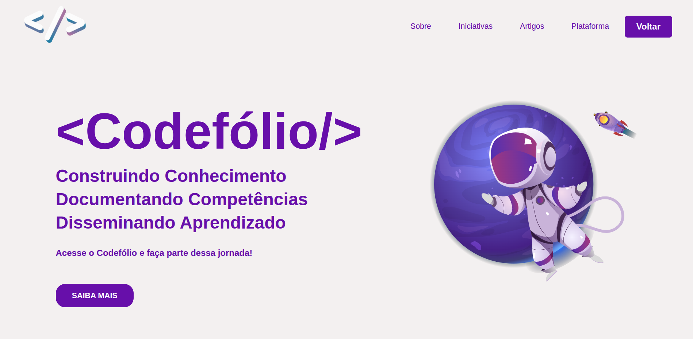 

## 🚀 Primeiros Passos

### 1. Página Inicial (Feed)

Ao acessar a plataforma, você encontrará o **Feed Principal** com:
- **Lista de Cursos Disponíveis**: Todos os cursos publicados na plataforma
- **Seus Cursos**: Cursos que você criou ou está matriculado
- **Painel de Navegação**: Acesso rápido às principais funcionalidades

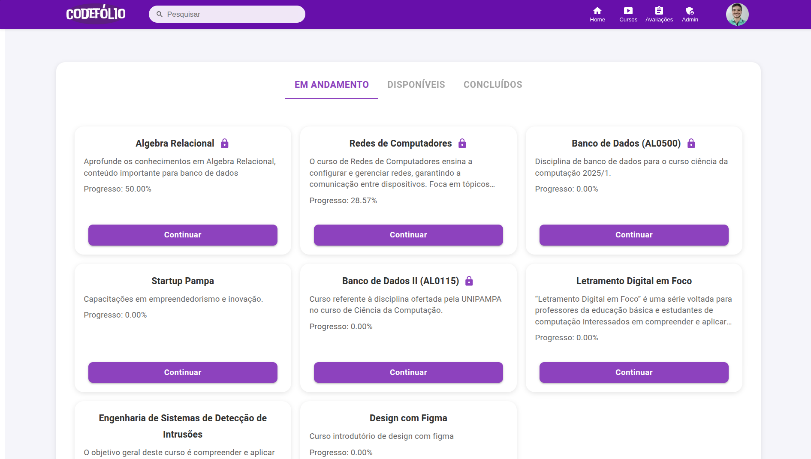

### 2. Perfil de Professor

Para criar e gerenciar cursos, você precisa ter perfil de **Professor/Administrador**. 

**Como verificar seu perfil:**
1. Clique no ícone de usuário no canto superior direito
2. Verifique se há a opção "Painel Administrativo"
3. Se não houver, solicite permissões ao administrador da plataforma

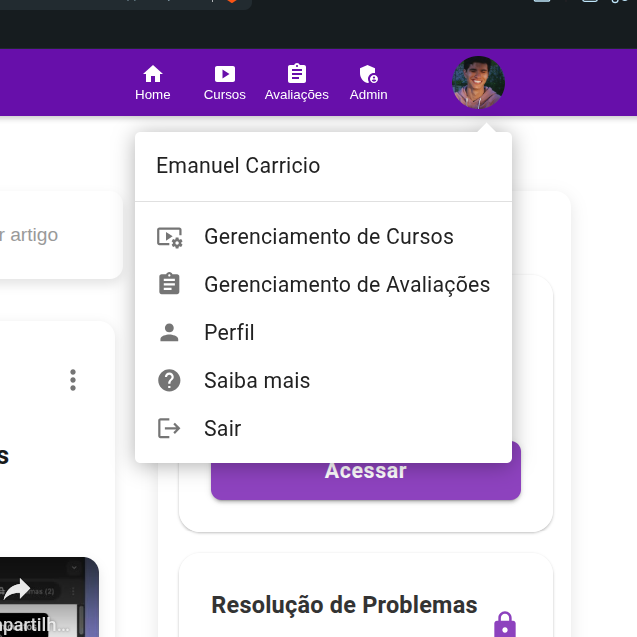

---

## 📚 Gerenciamento de Cursos

### Criar um Novo Curso

#### Passo 1: Acessar o Painel de Criação
1. No menu superior, clique em **"Gerenciamento de Curso"**
2. Clique no botão **"Criar Novo Curso"**
3. Você será direcionado para o painel de gerenciamento

#### Passo 2: Informações Básicas
Preencha os campos obrigatórios:
- **Título do Curso**: Nome descritivo do curso
- **Descrição**: Resumo do conteúdo e objetivos

**Configurações Opcionais:**
- **PIN de Acesso**: Habilite para restringir o acesso ao curso
  - Gera automaticamente um código de 7 dígitos
  - Alunos precisarão deste código para se matricular

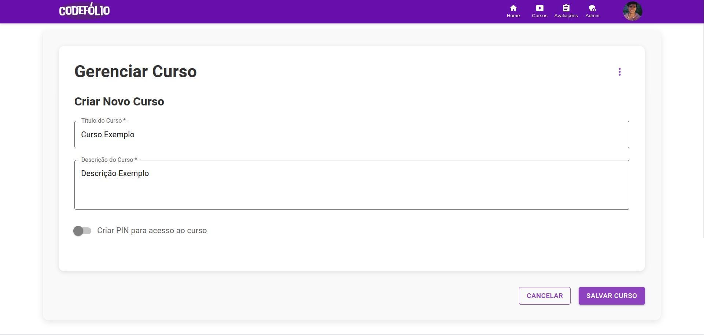

#### Passo 3: Adicionar Conteúdo

O curso é organizado em **5 abas principais**:

##### 📹 Aba Vídeos
Adicione aulas em vídeo:

1. Cole a **URL do vídeo** (YouTube, Vimeo, etc.)
2. Defina um **título** para a aula
3. (Opcional) Marque **"Exige vídeos anteriores"** para controlar a progressão
4. Clique em **"Adicionar Vídeo"**

**Dicas:**
- Use URLs de vídeos públicos ou não listados
- Organize os vídeos na ordem de aprendizado
- Nomeie os vídeos de forma clara (Ex: "Aula 01 - Introdução", "Aula 02 - Conceitos Básicos")

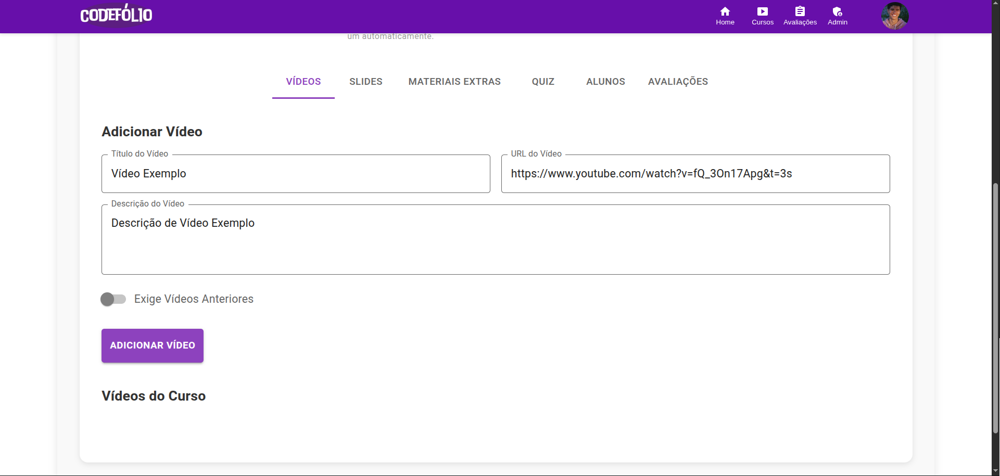
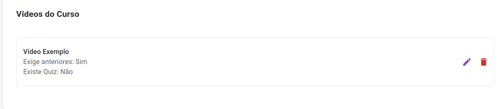

##### 📊 Aba Slides
Adicione apresentações do Google Slides:

1. No Google Slides, clique em **"Arquivo" > "Publicar na web"**
2. Copie o **link de incorporação**
3. Cole na plataforma Codefólio
4. Adicione um **título** e **descrição** (opcional)
5. Clique em **"Adicionar Slide"**

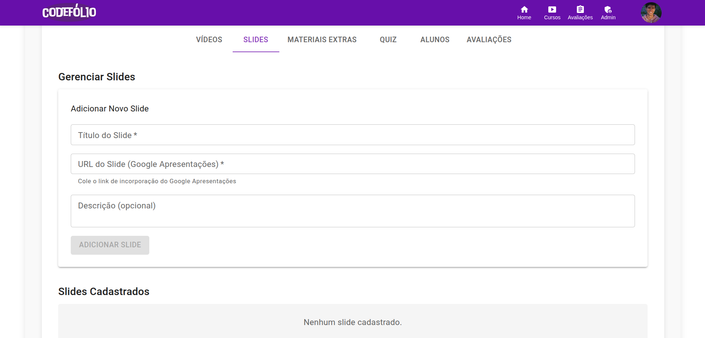
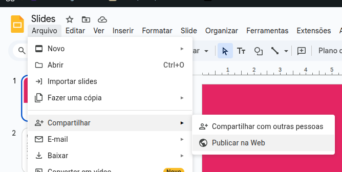

##### 📁 Aba Materiais Extras
Compartilhe recursos complementares:

1. Adicione um **nome** para o material (Ex: "Apostila Completa", "Exercícios Práticos")
2. Cole o **link do material** (Google Drive, Dropbox, etc.)
3. Clique em **"Adicionar Material"**

**Tipos de materiais suportados:**
- PDFs
- Documentos
- Planilhas
- Arquivos compactados
- Links externos

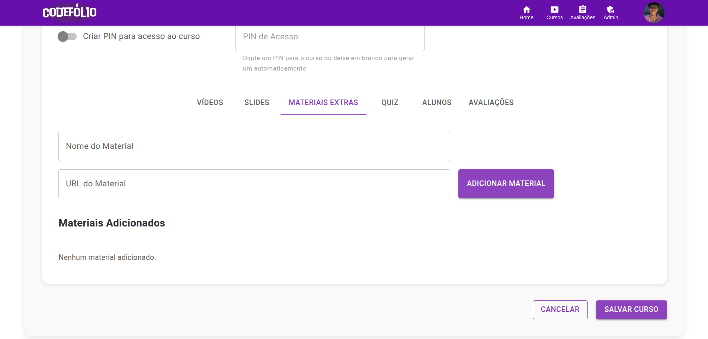

##### ❓ Aba Quiz
Configuração avançada de quizzes (explicada na próxima seção)

##### 👥 Aba Alunos
Visualize alunos matriculados e seu progresso

#### Passo 4: Salvar o Curso
1. Revise todas as informações
2. Clique em **"Salvar Curso"**
3. Aguarde a confirmação de sucesso

### Editar um Curso Existente

1. Acesse **"Meus Cursos"**
2. Clique em **"Gerenciar"** no curso desejado
3. Faça as alterações necessárias
4. Clique em **"Atualizar Curso"**

---

## 📝 Sistema de Quizzes

### Tipos de Quiz

A plataforma oferece **3 tipos de quizzes**:

1. **Quiz de Vídeo**: Avaliação após assistir um vídeo específico
2. **Quiz de Slide**: Avaliação após visualizar uma apresentação
3. **Quiz Diagnóstico**: Avaliação inicial para medir conhecimento prévio

### Criar um Quiz Tradicional

#### Passo 1: Acessar a Aba Quiz
1. No gerenciamento do curso, clique na aba **"Quiz"**
2. Escolha entre as sub-abas:
   - **Quizzes de Vídeos**
   - **Quizzes de Slides**

#### Passo 2: Configurar o Quiz

**Para Quiz de Vídeo:**
1. Selecione o **vídeo** na lista dropdown
2. Defina a **Nota Mínima** para aprovação (0-100)
3. (Opcional) Marque como **"Quiz Diagnóstico"**
4. Clique em **"Adicionar Quiz"**

**Para Quiz de Slide:**
- Mesmo processo, selecionando o slide desejado

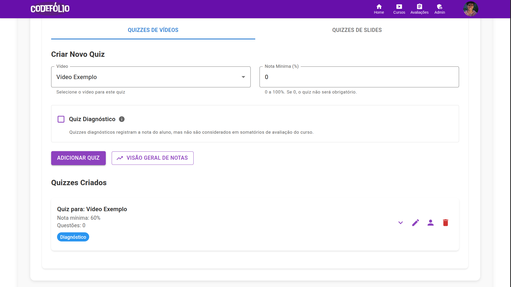

#### Passo 3: Adicionar Questões

Para cada questão:

1. Digite a **pergunta** no campo de texto
2. Adicione as **alternativas** (mínimo 2)
   - Clique em **"+ Adicionar Opção"** para mais alternativas
3. Selecione a **resposta correta** no dropdown
4. Clique em **"Adicionar Questão"**

**Dicas:**
- Crie pelo menos 5 questões por quiz
- Use linguagem clara e objetiva
- Evite pegadinhas desnecessárias
- Alterne a posição da resposta correta

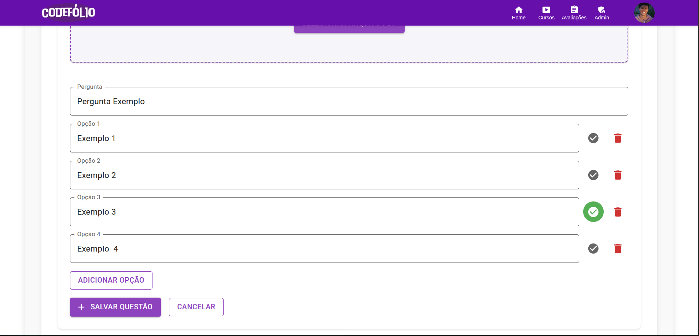
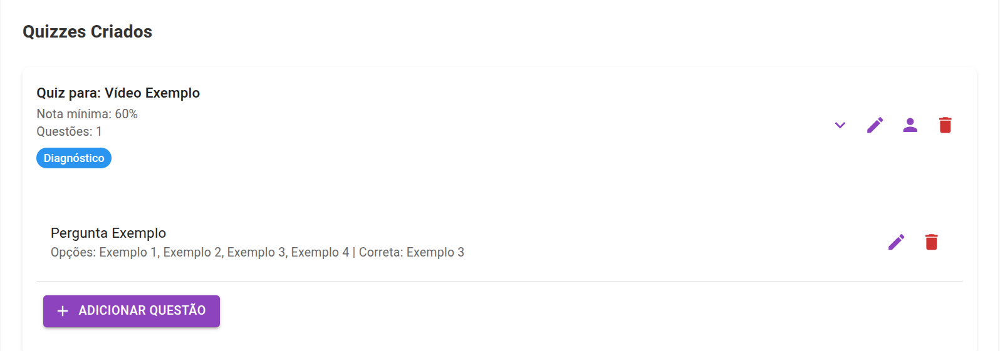

#### Passo 4: Gerenciar Questões

**Editar uma questão:**
1. Clique no ícone de **lápis** ao lado da questão
2. Modifique os campos desejados
3. Clique em **"Salvar Alterações"**

**Remover uma questão:**
1. Clique no ícone de **lixeira**
2. Confirme a exclusão

### Gerador de Quiz com IA

A plataforma possui um **gerador automático de questões** usando Inteligência Artificial.

#### Como Funciona

1. Na aba Quiz, localize o **"Gerador de Questões PDF"**
2. Clique em **"Carregar PDF"** e selecione seu arquivo
3. Configure as opções:
   - **Número de questões**: Quantas perguntas deseja gerar (1-50)
   - **Modelo de IA**: Escolha o modelo (recomendado: Qwen 3 32B)
4. Clique em **"Gerar Questões"**

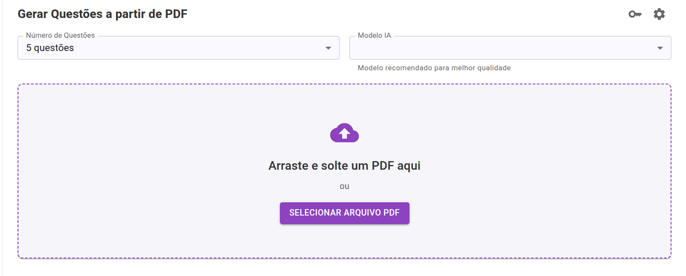

#### Aguardar Processamento

O sistema irá:
1. Extrair o texto do PDF (barra de progresso 0-50%)
2. Gerar as questões com IA (barra de progresso 50-100%)
3. Exibir as questões geradas

#### Revisar e Adicionar

1. Revise cada questão gerada
2. **Edite** se necessário (clique no ícone de lápis)
3. **Remova** questões inadequadas (clique no ícone de lixeira)
4. Clique em **"Adicionar ao Quiz"**

**Importante:** Sempre revise as questões geradas! A IA pode cometer erros.

#### Configurações Avançadas (Opcional)

Clique no ícone de **engrenagem** para:
- **Personalizar o prompt**: Modifique as instruções para a IA
- **Configurar chave API**: Use sua própria chave GROQ (caso tenha)

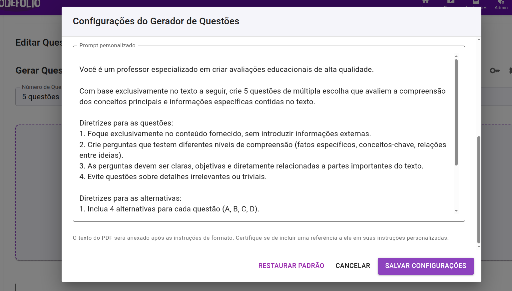

### Configurações Avançadas de Quiz

Clique no ícone de **três pontos** no cabeçalho do curso para acessar:

**Configurações de Vídeo:**
- **Exigir conclusão anterior**: Alunos devem assistir vídeos na ordem

**Configurações de Quiz:**
- **Permitir refazer**: Alunos podem tentar novamente após erro
- **Mostrar resultado**: Exibir nota imediatamente após conclusão

---

## 🎯 Avaliações Personalizadas

Além dos quizzes automáticos, você pode criar **avaliações personalizadas** com pesos diferenciados.

### Acessar Sistema de Avaliações

1. No menu principal, clique em **"Gerenciar Avaliações"**
2. Selecione o **curso** desejado nas abas superiores

### Criar uma Avaliação

#### Passo 1: Definir Informações

1. Clique em **"+ Criar Avaliação"**
2. Preencha os campos:
   - **Nome da Avaliação**: Ex: "Prova 1", "Trabalho Final"
   - **Peso**: Valor relativo na nota final (Ex: 30 = 30%)
   - **Descrição**: Instruções e critérios (opcional)
3. Clique em **"Criar"**

#### Passo 2: Atribuir Notas

1. A avaliação aparecerá na lista
2. Clique em **"Atribuir Notas"**
3. Para cada aluno:
   - Digite a **nota** (0-100)
   - (Opcional) Adicione um **comentário**
4. Clique em **"Salvar Nota"**

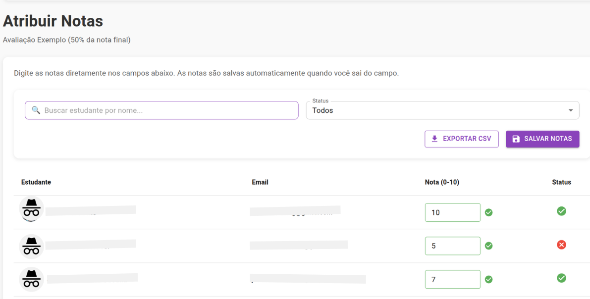

### Visualizar Notas Gerais

Na aba **"Notas Gerais"**, você verá:
- **Tabela consolidada** com todas as avaliações
- **Média ponderada** de cada aluno
- **Status de aprovação** (baseado na média)

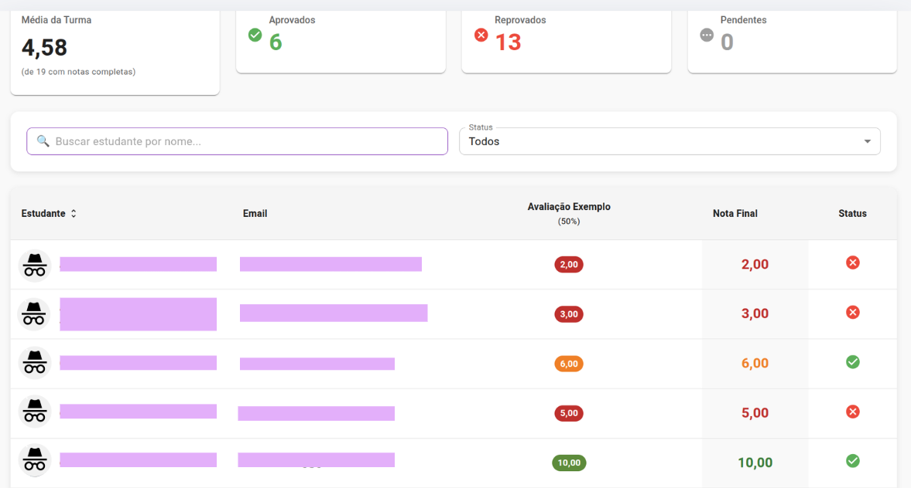

### Exportar Notas

1. Na página de notas, clique em **"Exportar CSV"**
2. O arquivo será baixado com:
   - Nome dos alunos
   - Notas de todas as avaliações
   - Médias finais

---

## 👨‍🎓 Acompanhamento de Alunos

### Painel de Alunos do Curso

1. Acesse o gerenciamento do curso
2. Clique na aba **"Alunos"**

**Você verá:**
- Lista de alunos matriculados
- Progresso individual (% de vídeos assistidos)
- Última atividade
- Ações disponíveis

### Visão Geral de Notas dos Quizzes

A plataforma oferece um **dashboard completo** de desempenho em quizzes.

#### Acessar o Dashboard

1. Na aba **"Quiz"**, clique em **"Visão Geral de Notas"**
2. Você será direcionado para uma análise detalhada

#### Métricas Exibidas

**Cards de Resumo:**
- **Média Geral da Turma**: Desempenho médio em todos os quizzes
- **Total de Estudantes**: Quantidade de alunos matriculados
- **Quizzes Disponíveis**: Número total de avaliações no curso
- **Taxa de Conclusão Média**: Percentual de quizzes realizados

#### Tabela de Desempenho

A tabela mostra para cada aluno:
- **Nome e Email**
- **Média Geral**: Nota média em todos os quizzes
- **Quizzes Realizados**: Quantidade de tentativas
- **Quizzes Aprovados**: Quantos passou com nota mínima
- **Taxa de Conclusão**: Percentual de quizzes feitos

#### Filtros e Ordenação

**Filtrar por status:**
- Todos os alunos
- Aprovados (média ≥ 7)
- Em recuperação (média 5-6.99)
- Reprovados (média < 5)

**Ordenar por:**
- Nome (A-Z ou Z-A)
- Média geral (crescente/decrescente)
- Taxa de conclusão
- Quizzes realizados

**Buscar aluno:** Digite o nome na barra de pesquisa

#### Detalhes do Aluno

1. Clique no botão **"Ver Detalhes"** de qualquer aluno
2. Visualize o **desempenho detalhado por quiz**:
   - Nome do quiz (vídeo ou slide)
   - Nota obtida
   - Status (Aprovado/Reprovado/Não realizado)
   - Tipo de quiz (Vídeo/Slide/Diagnóstico)

#### Navegar para Conteúdo

- Clique no **nome de um quiz** para ser redirecionado ao vídeo/slide correspondente
- Útil para revisar o conteúdo junto com o aluno

#### Exportar Relatório Completo

1. Clique em **"Exportar para CSV"**
2. O arquivo incluirá:
   - Dados de todos os alunos
   - Notas individuais de cada quiz
   - Classificação de bônus (Live Quiz e Custom Quiz)
   - Médias e estatísticas

## 🎮 Recursos Avançados

### Live Quiz (Quiz ao Vivo)

O **Live Quiz** é uma ferramenta para aplicar quizzes em tempo real durante as aulas.

#### Como Funciona

1. Durante uma aula presencial ou online
2. Acesse o curso e abra o **quiz desejado**
3. Clique no ícone de **Quiz ao Vivo** (🎮)
4. Compartilhe a tela com os alunos

#### Iniciar o Quiz

1. Clique em **"Iniciar Quiz"**
2. A primeira questão será exibida
3. Alunos respondem em seus dispositivos
4. Clique em **"Próxima Questão"** para avançar

#### Recursos Durante o Quiz

**Sortear Aluno:**
- Clique no botão **"Sortear Aluno"**
- Um aluno aleatório será escolhido
- Útil para fazer perguntas orais

**Visualizar Respostas:**
- Veja quantos alunos responderam
- Identifique quem acertou ou errou
- Feedback em tempo real

#### Ranking ao Vivo

Ao final, é exibido um **ranking** com:
- Nome dos alunos
- Quantidade de acertos
- Pontuação total
- Posição no ranking

**Categorias:**
- 🏆 **1º Lugar**: Medalha de ouro
- 🥈 **2º Lugar**: Medalha de prata
- 🥉 **3º Lugar**: Medalha de bronze

### Custom Quiz

Modo alternativo onde:
- Professor faz perguntas **não cadastradas**
- Registra manualmente quem acertou
- Útil para debates e participações

**Como usar:**
1. No Live Quiz, clique em **"Modo Custom"**
2. Faça uma pergunta oralmente
3. Marque os alunos que acertaram
4. A pontuação é somada ao ranking

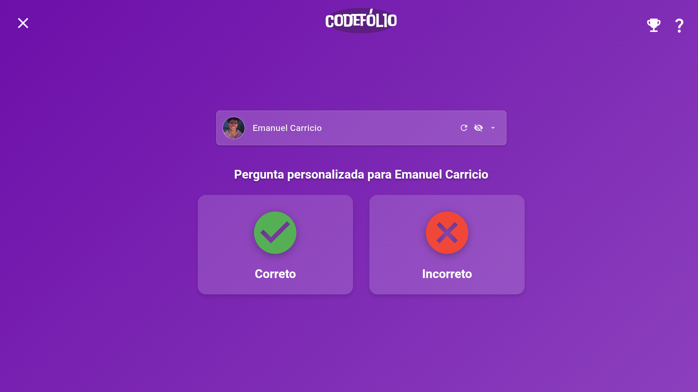

### Materiais Extras Avançados

#### Organizar Materiais

**Boas práticas:**
- Agrupe por **tipo**: Apostilas, Exercícios, Referências
- Use **nomes descritivos**: "Apostila - Módulo 1", "Lista de Exercícios 1"
- Inclua **instruções** de uso na descrição

#### Links Recomendados

- **Google Drive**: Compartilhe pastas completas
- **Dropbox**: Para arquivos grandes
- **GitHub**: Para códigos e projetos
- **Notion/Confluence**: Para documentações

### Configurações de Privacidade

#### PIN de Acesso

**Quando usar:**
- Cursos pagos ou restritos
- Turmas específicas
- Controle de matrículas

**Como funciona:**
1. Habilite o PIN nas configurações do curso
2. Um código de 7 dígitos é gerado
3. Compartilhe com os alunos autorizados
4. Alunos inserem o PIN ao tentar acessar

### Dashboard do Professor

Acesse **"Painel Administrativo"** para:

**Gerenciar Usuários:**
- Visualizar todos os usuários
- Alterar permissões (aluno ↔ professor)
- Remover usuários inativos

**Gerenciar Cursos:**
- Visualizar todos os cursos da plataforma
- Editar ou remover cursos de outros professores (admin)

**Visualizar Reportes:**
- Alunos podem enviar **reportes** de problemas clicando no botão vermelho acima do vídeo de um curso

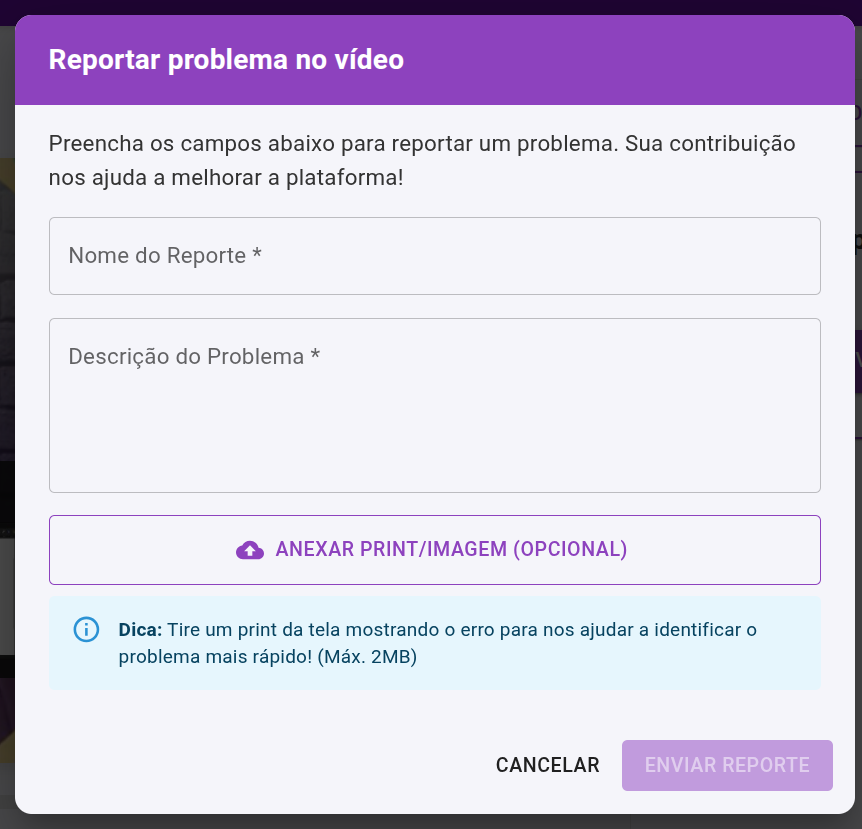

## 💡 Dicas e Melhores Práticas

### Estruturando um Curso

1. **Planejamento:**
   - Defina objetivos de aprendizado claros
   - Divida em módulos temáticos
   - Planeje a progressão de dificuldade

2. **Conteúdo em Vídeo:**
   - Vídeos de 10-15 minutos são ideais
   - Use títulos descritivos e numerados
   - Revise antes de adicionar

3. **Quizzes Eficazes:**
   - Crie quizzes após cada módulo
   - 5-10 questões por quiz
   - Varie os tipos de questões (conceituais, práticas, aplicação)

4. **Materiais Complementares:**
   - Adicione apostilas resumidas
   - Inclua exercícios extras opcionais
   - Disponibilize referências externas

### Engajamento dos Alunos

- Use **Live Quiz** nas aulas síncronas
- Ative **rankings** para gamificação
- Permita **refazer quizzes** para fixação
- Dê **feedback** nas avaliações personalizadas

### Acompanhamento Contínuo

- Revise o **dashboard de notas** semanalmente
- Identifique alunos com dificuldades
- Ofereça materiais extras aos que precisam
- Ajuste conteúdos baseando-se no desempenho

---

## 🆘 Problemas Comuns e Soluções

### Vídeo não carrega
- Verifique se a URL está correta
- Certifique-se de que o vídeo é **público** ou **não listado**
- Evite URLs com restrições de incorporação

### Quiz não aparece para o aluno
- Confirme se o quiz está **salvo**
- Verifique se o aluno assistiu ao **vídeo anterior** (se configurado)
- Certifique-se de que há **questões adicionadas**

### Alunos não conseguem acessar o curso
- Verifique se o **PIN está correto** (se habilitado)
- Confirme se os alunos estão **logados na plataforma**
- Certifique-se de que o curso está **salvo e publicado**

### Questões geradas pela IA estão incorretas
- A IA pode cometer erros - **sempre revise**
- Edite ou remova questões problemáticas
- Use PDFs com **textos claros e estruturados**
- Experimente **modelos diferentes** se necessário

---

## 📞 Suporte

Para dúvidas ou problemas técnicos:
- Envie um reporte pela própria plataforma
- Entre em contato com o administrador do sistema
- Consulte esta documentação regularmente

---
